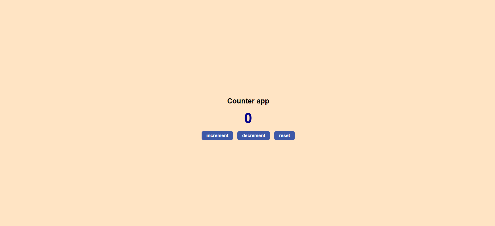

# Counter App 🧮

A simple and beginner-friendly Counter App built using **HTML**, **CSS**, and **JavaScript**. It allows users to increment, decrement, and reset a counter — with a special message when the count reaches 10 🎉.

---

## ✨ Features

- ✅ Increase the counter by 1
- ✅ Decrease the counter (not below 0)
- ✅ Reset to 0
- 🎉 Shows a message when count reaches 10

---


## 📁 Technologies Used

- HTML
- CSS
- JavaScript

---

## 📷 Screenshot

  
*Add a screenshot of your app running in the browser*

---

## 🧠 What I Learned

- DOM manipulation using JavaScript
- Event listeners (`addEventListener`)
- Updating UI based on state

---

## 📦 How to Run Locally

1. Clone the repo:
   ```bash
   git clone https://github.com/systemandtec2002/100-Frontend-Mini-Projects.git
