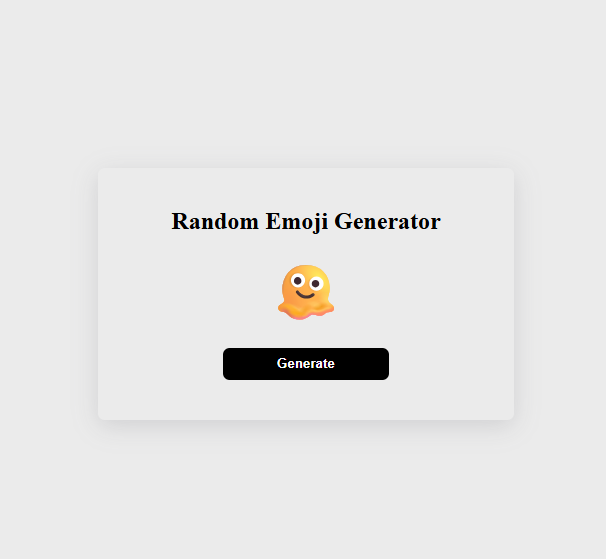

# 🎰 Random Emoji Generator

This is a fun and beginner-friendly **Random Emoji Generator** built using **HTML**, **CSS**, and **JavaScript**. With each click, a new emoji is randomly selected from a large emoji array and displayed on the screen.

---

## 📸 Preview

 

---

## 🧠 What I Learned

- Using **arrays** in JavaScript
- Generating a **random value**
- Manipulating the **DOM** with `textContent`
- Basic **HTML** structure and **CSS** styling
- Handling `onClick` events

---

## 🛠️ Built With

- HTML
- CSS
- JavaScript

---

## 🖱️ How to Use

1. Open the website in your browser.
2. Click the **"Generate"** button.
3. A new random emoji will appear every time!

---

## 🤩 Sample Emojis

Some of the random emojis you might get:

`😀`, `😇`, `🥶`, `🤯`, `👽`, `😭`, `🫠`, `💩`, `🤖`, `😿`

---

## 📬 Feedback

If you liked the project, feel free to ⭐ star the repo and share your suggestions or feedback!

---

