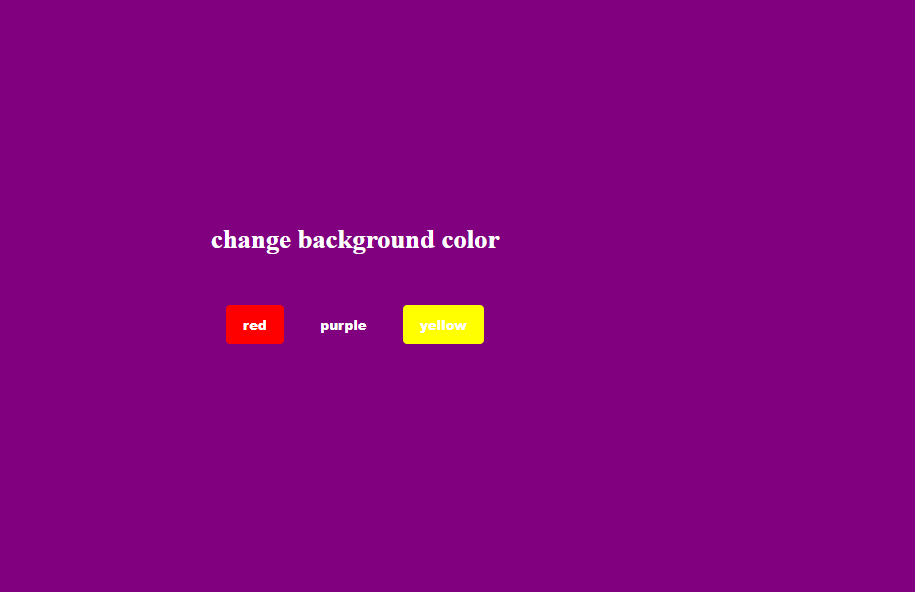

# 🎨 Mini Challenge (Level-1 Super Easy) – Background Color Changer

This is a beginner-friendly mini project where the background color of the page changes when you click one of the color buttons.

---

## 🧠 Learning Goals

- DOM manipulation using **JavaScript**
- Handling **onclick events**
- Connecting **HTML, CSS, and JS**
- Practicing **beginner-level logic**

---

## 🚀 How to Use

1. Open the `index.html` file in your browser.
2. Click on any of the buttons: **Red**, **Purple**, or **Yellow**.
3. The background color of the entire page will change to the selected color.

---

## ✨ Demo Screenshot

👉 Screenshot after clicking one of the color buttons:

;

---

## 🛠️ Technologies Used

- HTML5
- CSS3
- JavaScript (Vanilla)

---

## 📚 What You’ll Learn

- How to handle `onclick` events using HTML
- How to change the `style` of an element using JavaScript
- How to organize files in a simple frontend project

---

