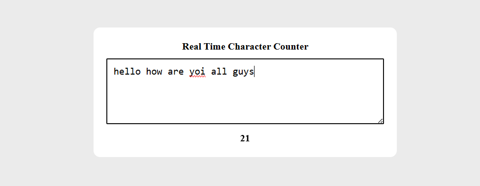

# Real-Time Character Counter

A simple web application that counts the number of characters in a text area as you type, updating the count in real time.

## 📌 Features
- Real-time character counting
- Clean and minimal design
- Easy to integrate into any project

## 🖼 Demo
Type inside the textarea and watch the counter update instantly.

---

## 📸 Preview


---


## 🛠 Technologies Used
- **HTML** – Structure of the page
- **CSS** – Styling for a clean UI
- **JavaScript** – Logic for updating the counter dynamically


## 🚀 How to Use
1. Clone or download the repository.
2. Open `index.html` in your web browser.
3. Start typing in the textarea to see the character count update.


## 📜 Code Overview

### HTML
```html
<textarea id="textarea"></textarea>
<div id="counter">0 character</div>
JavaScript
javascript
Copy code
let textArea = document.getElementById('textarea');
let counter = document.getElementById('counter');

textArea.addEventListener('input', () => {
  let count = textArea.value.length;
  counter.innerHTML = `${count} character${count !== 1 ? 's' : ''}`;
});
