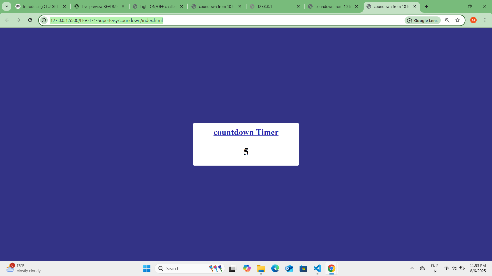

# ⏳ Countedo – Countdown Timer (10 to 0)

**Countedo** is a fun and beginner-friendly countdown timer that starts from 10 and goes down to 0 using HTML, CSS, and JavaScript. When the countdown completes, it displays a final success message to the user.

---

## 🔍 What is Countedo?

🕒 A simple countdown timer from 10 to 0  
🎉 When the countdown ends, it shows: **"🎉 Countdown Complete!"**  
🧠 A great project to practice JavaScript timing functions and DOM updates

---

## 🛠️ Tech Stack

- **HTML5** – Page structure
- **CSS3** – Styling and layout
- **JavaScript (Vanilla)** – Countdown logic

---

## 📸 Project Screenshot

---

## 🚀 Live Preview

➡️ The countdown begins as soon as the page loads.  
➡️ Numbers decrease every second using `setInterval`.  
➡️ When it reaches zero, the countdown stops and a success message is displayed with green color and styled text.
\

