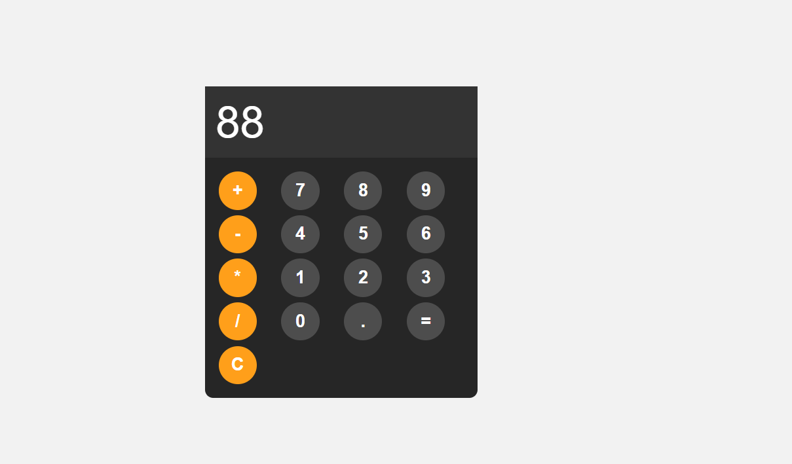

# 🧮 Simple Calculator

A basic, stylish calculator built using **HTML**, **CSS**, and **JavaScript**.  
This project demonstrates DOM manipulation, event handling, and basic JavaScript error handling with `try...catch`.


---

## 📸 Preview


---


## 🚀 Features
- Basic arithmetic operations: **Add**, **Subtract**, **Multiply**, **Divide**
- Responsive button hover & click effects
- Error handling for invalid expressions
- Read-only display to prevent direct typing
- Clean, modern design

---

## 🛠 Technologies Used
- HTML5
- CSS3
- JavaScript (ES6+)

---

## 📖 How to Use
1. Clone this repository:
   ```bash
   git clone https://github.com/your-username/calculator.git
