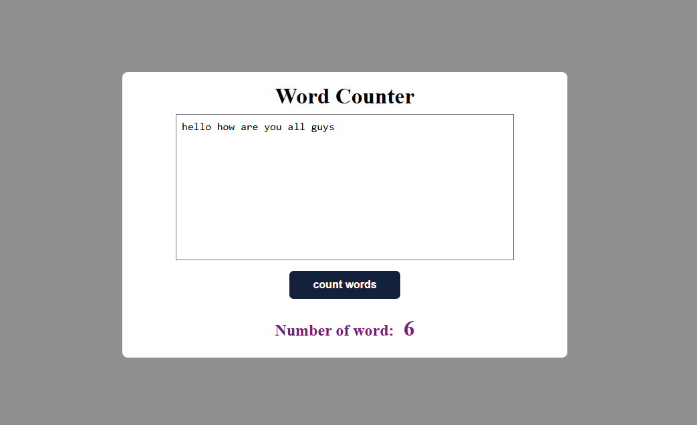

# 📝 Word Counter

A beginner-friendly web app that counts the number of words in the given text input using **HTML**, **CSS**, and **JavaScript**.

---

## 🚀 Features

- 🧾 Counts the number of words accurately
- ✨ Clean and responsive design
- 🎯 Instant result on button click
- 🖱️ Easy-to-use interface

---

## 📸 Preview


 

---

## 🛠️ Built With

- HTML
- CSS
- JavaScript

---


## 📌 How to Use

1. Clone or download this repository.
2. Open `index.html` in your browser.
3. Type or paste any text in the textarea.
4. Click the **"Count Words"** button.
5. The total word count will be displayed below the button.

---

## 🔧 Word Counting Logic Explained

```javascript
let wordsTrimmed = words.replace(/\s+/g, " ").trim();
let splitWords = wordsTrimmed.split(" ");
let numberOfWords = splitWords.length;
